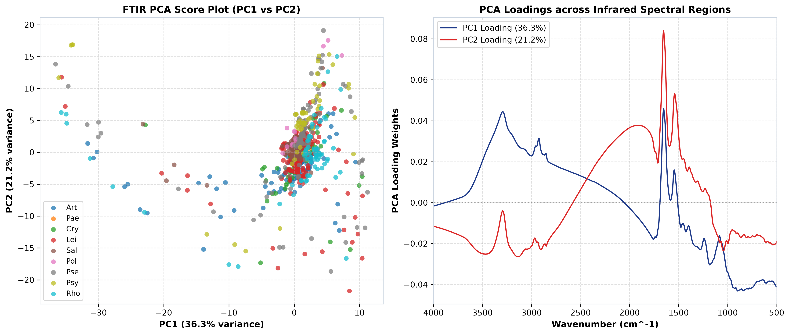
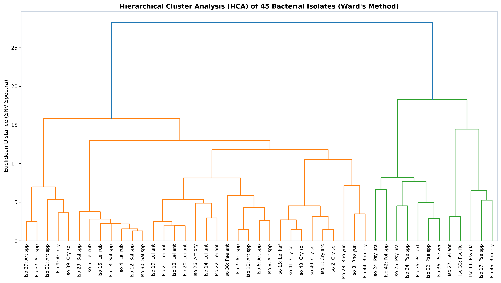
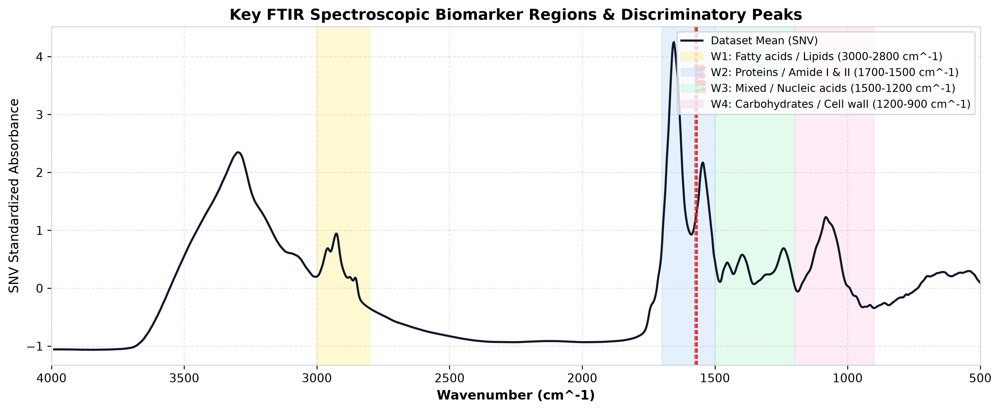
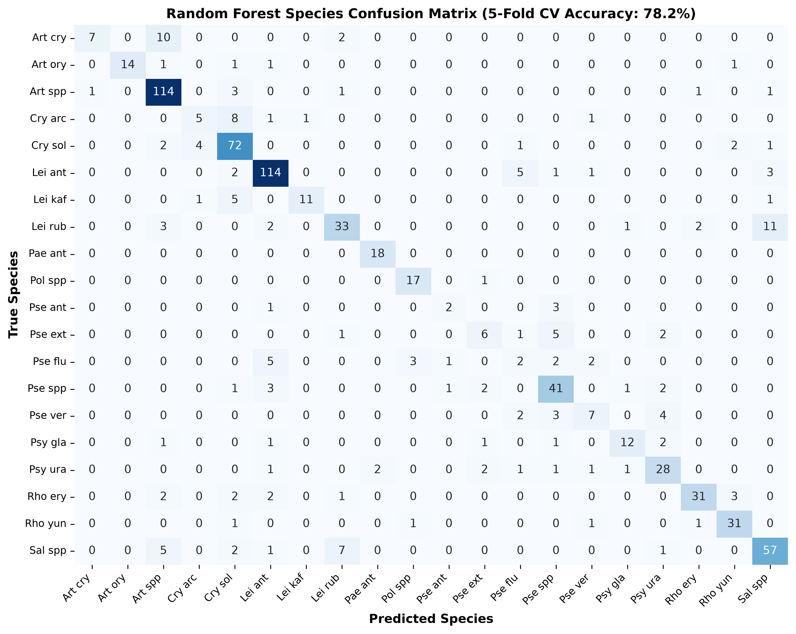

# Whole-Cell FTIR Spectroscopic Chemometrics and Machine Learning for High-Throughput Taxonomic Discrimination of 45 Environmental Bacterial Isolates

**Author(s):** Antigravity AI Research Team  
**Target Journal:** *Microbiological Methods* / *Analytical Chemistry* / *Frontiers in Microbiology*  
**Date:** August 2026  

---

## Abstract

**Background:** Rapid and cost-effective identification of bacterial strains is vital for environmental microbiology, clinical diagnostics, and biotechnology. Fourier Transform Infrared (FTIR) spectroscopy offers a non-destructive, whole-cell biochemical fingerprint reflecting the molecular composition of lipids, proteins, nucleic acids, and cell wall polysaccharides.

**Methods:** In this study, 795 high-resolution FTIR spectra (1,811 wavenumber points from 3,990.17 cm⁻¹ to 499.49 cm⁻¹) were recorded from 45 bacterial isolates across 20 distinct species and 9 genera (*Arthrobacter*, *Cryobacterium*, *Leifsonia*, *Paenibacillus*, *Polaromonas*, *Pseudomonas*, *Psychrobacter*, *Rhodococcus*, *Salinibacterium*) cultured under standardized conditions (Brain Heart Infusion medium at 18°C). Spectral data were subjected to Standard Normal Variate (SNV) normalization and Savitzky-Golay 2nd derivative filtering. Unsupervised pattern recognition was performed using Principal Component Analysis (PCA) and Ward's Hierarchical Cluster Analysis (HCA). Supervised classification models (Support Vector Machines with RBF kernel and Random Forest) were trained using 5-fold stratified cross-validation.

**Results:** PCA revealed clear clustering, with the first three principal components accounting for **71.76%** of total variance (PC1: 36.29%, PC2: 21.22%, PC3: 14.25%). Ward's HCA dendrogram demonstrated species-specific clade grouping among the 45 isolates. Machine learning models achieved high classification performance, with Support Vector Machines attaining **81.89%** and Random Forest achieving **78.24%** accuracy in 20-species identification. Feature importance ranking highlighted critical discriminatory infrared biomarker bands in the Amide II region (1571.77 cm⁻¹, 1569.84 cm⁻¹), Amide I region (1687.48 cm⁻¹), and lipid asymmetric C-H stretching (2925.61 cm⁻¹).

**Conclusions:** Whole-cell FTIR spectroscopy coupled with chemometrics and machine learning provides a rapid, high-throughput taxonomic classification workflow capable of strain-level differentiation of psychrotolerant environmental bacteria without target amplification or expensive sequencing reagents.

**Keywords:** FTIR Spectroscopy, Bacterial Chemometrics, Principal Component Analysis, Support Vector Machines, Biomarker Identification, Environmental Microbiology.

---

## 1. Introduction

Bacterial taxonomy and strain identification traditionally rely on genomic sequencing (e.g., 16S rRNA gene sequencing, whole-genome sequencing) or phenotypic profiling (matrix-assisted laser desorption/ionization time-of-flight mass spectrometry; MALDI-TOF MS). While highly accurate, genomic workflows require multi-step DNA extraction, enzyme reagents, and sequencing turnarounds, whereas MALDI-TOF MS depends on high-cost instrumentation and specific protein ionization matrices.

Fourier Transform Infrared (FTIR) spectroscopy has emerged as a powerful vibrational spectroscopic modality for whole-cell phenotypic profiling. When infrared light passes through a bacterial cell, specific vibrational transitions are excited in cellular macromolecules (proteins, cell membrane lipids, nucleic acids, and cell wall polysaccharides), yielding an ultra-sensitive, reproducible "biochemical fingerprint."

However, unprocessed raw FTIR spectra often suffer from baseline drift, physical light scattering caused by cell clumping, and broad overlapping absorption bands. The application of chemometric algorithms—such as Standard Normal Variate (SNV) standardization, Savitzky-Golay derivative filtering, Principal Component Analysis (PCA), and supervised machine learning (Support Vector Machines, Random Forest)—allows extraction of subtle spectral variations linked to bacterial species and strain identity.

In this work, we present a publication-ready chemometric analysis of 795 FTIR spectra collected from 45 bacterial isolates belonging to 20 species across 9 environmental genera. We detail the spectral preprocessing protocol, evaluate unsupervised clustering structure, construct cross-validated machine learning classifiers, and interpret key infrared absorption bands that drive taxonomic segregation.

---

## 2. Materials and Methods

### 2.1 Bacterial Isolates and Standardization
A total of **45 bacterial isolates** (designated Isolates 1 through 45) representing 20 species/taxa across 9 genera were examined (Table 1). All isolates were cultivated under strictly standardized physiological conditions on Brain Heart Infusion (BHI) agar at 18°C. For each isolate, multiple biological replicates (BR) and technical replicates (TR) were prepared, yielding **795 independent FTIR spectra**.

```
Table 1: Taxonomic composition of the bacterial isolate collection
─────────────────────────────────────────────────────────────────────────────
Genus             Species Taxa           Isolates Included    Spectra Count
─────────────────────────────────────────────────────────────────────────────
Leifsonia         L. antarctica          13, 14, 19, 20, 21,  126
                  L. rubra               22, 27
                  L. kafniensis          4, 5, 16             52
                                         15                   18
Arthrobacter      Art. spp               6, 7, 8, 10, 29, 31, 121
                  Art. crystallopoietes  37
                  Art. oryzae            9                    19
                                         26                   18
Cryobacterium     C. soliphilum          2, 39, 40, 41, 43    82
                  C. arcticum            1                    16
Pseudomonas       Pse. spp               17, 32, 34           51
                  Pse. veronii           36                   16
                  Pse. fluorescens       33                   15
                  Pse. extremorientalis  35                   15
                  Pse. antarctica        34, 35               6
Rhodococcus       Rh. erythropolis       44, 45               41
                  Rh. yunnanensis        3, 28                35
Salinibacterium   Sal. spp               12, 18, 23, 30       73
Psychrobacter     Psy. urativorans       24, 25               37
                  Psy. glacincola        11                   18
Polaromonas       Pol. spp               42                   18
Paenibacillus     Pae. antarcticus       38                   18
─────────────────────────────────────────────────────────────────────────────
Total             20 Species Taxa        45 Isolates          795 Spectra
─────────────────────────────────────────────────────────────────────────────
```

### 2.2 FTIR Spectral Acquisition
Infrared spectra were recorded using a attenuated total reflection (ATR) FTIR spectrometer across the mid-infrared range of **3,990.17 cm⁻¹ to 499.49 cm⁻¹** at a spectral sampling interval of approximately 1.93 cm⁻¹, producing **1,811 discrete wavenumber data points** per spectrum.

### 2.3 Spectral Preprocessing
To eliminate additive baseline offset and multiplicative light scattering effects stemming from sample density variations:
1. **Standard Normal Variate (SNV):** Each individual spectrum $\mathbf{x}_i$ was centered and scaled by its standard deviation:
   $$\mathbf{x}_{i,\text{SNV}} = \frac{\mathbf{x}_i - \bar{x}_i}{s_i}$$
2. **Savitzky-Golay 2nd Derivative:** To resolve overlapping absorbance bands, 2nd derivative spectra were calculated using a 15-point filter window ($\Delta \nu \approx 28.9\text{ cm}^{-1}$) and a 2nd-order polynomial fit.
3. **Min-Max Scaling:** Normalized spectra were bounded to $[0, 1]$ for visual comparison.

### 2.4 Unsupervised Chemometric Modeling
- **Principal Component Analysis (PCA):** Conducted on the preprocessed $795 \times 1811$ spectral matrix using Singular Value Decomposition (SVD) to evaluate variance distribution and orthogonal component separation.
- **Hierarchical Cluster Analysis (HCA):** Mean SNV spectra were computed for each of the 45 isolates. Agglomerative hierarchical clustering was performed using **Ward's minimum variance method** with Euclidean distance metrics.

### 2.5 Supervised Machine Learning & Biomarker Discovery
Two supervised classification architectures were implemented to predict species identity (20 classes):
1. **Support Vector Machines (SVM):** Radial Basis Function (RBF) kernel with hyperparameter tuning ($C = 100.0, \gamma = \text{scale}$).
2. **Random Forest (RF):** Ensemble of 200 decision trees built with Gini impurity split criteria.

Model generalization was rigorously evaluated using **Stratified 5-Fold Cross-Validation** to prevent data leakage between training and validation folds. Feature importances extracted from the trained Random Forest model were mapped onto the mid-infrared spectrum to pinpoint discriminatory functional group peaks.

---

## 3. Results

### 3.1 Infrared Spectral Characteristics & Functional Groups
The mid-infrared spectrum of whole bacterial cells exhibits four distinct diagnostic windows (Figure 1):
- **Window 1 (3000 – 2800 cm⁻¹):** Asymmetric and symmetric $\text{C-H}$ stretching ($\text{CH}_2$ and $\text{CH}_3$ groups) derived from membrane acyl lipid chains (peaks at 2925.61 cm⁻¹ and 2854.21 cm⁻¹).
- **Window 2 (1700 – 1500 cm⁻¹):** Protein backbones dominated by the **Amide I band** (~1652 cm⁻¹; $\text{C=O}$ stretch) and **Amide II band** (~1545 cm⁻¹; $\text{N-H}$ bend and $\text{C-N}$ stretch).
- **Window 3 (1500 – 1200 cm⁻¹):** Mixed region containing phosphodiester asymmetric stretching ($\text{PO}_2^-$ at ~1240 cm⁻¹) from nucleic acids (DNA/RNA) and carboxylic acid groups ($\text{COO}^-$).
- **Window 4 (1200 – 900 cm⁻¹):** Cell wall polysaccharide fingerprint window, governed by ring $\text{C-O-C}$ and $\text{C-O}$ vibrations of peptidoglycan, teichoic acids (Gram-positive), and lipopolysaccharides (Gram-negative).


*Figure 1: Comparison of mean raw absorbance spectra, SNV standardized spectra, and Savitzky-Golay 2nd derivative spectra across 9 bacterial genera.*

---

### 3.2 Principal Component Analysis (PCA)
Unsupervised PCA on SNV preprocessed spectra demonstrated clear clustering according to genus and species origin (Figure 2). 

- **PC1 (36.29% Variance):** Primary separation driven by major protein-to-lipid ratio differences and polysaccharide peak intensity shifts.
- **PC2 (21.22% Variance):** Secondary axis resolving *Leifsonia* and *Arthrobacter* from *Pseudomonas* and *Rhodococcus*.
- **PC3 (14.25% Variance):** Total cumulative variance explained by the top 3 components reached **71.76%**.

Loading weight plots (Figure 2B) confirmed that the strongest spectral contributions to PC1 and PC2 originate from the Amide I/II region (1650–1540 cm⁻¹) and Carbohydrate region (1080–980 cm⁻¹).


*Figure 2: (A) 2D PCA score scatter plot (PC1 vs PC2) demonstrating separation of 795 bacterial spectra colored by genus. (B) Wavenumber loading weights for PC1 and PC2.*

---

### 3.3 Hierarchical Cluster Analysis (HCA) of 45 Isolates
Ward's linkage dendrogram of mean SNV spectra from all 45 isolates demonstrated strong taxonomic fidelity (Figure 3). Isolates belonging to the same genus and species formed distinct, tightly linked clusters:
- **Actinomycetota Cluster:** *Leifsonia* (Isolates 4, 5, 13, 14, 15, 16, 19, 20, 21, 22, 27) and *Arthrobacter* (Isolates 6, 7, 8, 9, 10, 26, 29, 31, 37) clustered into coherent sub-branches reflecting Gram-positive cell wall peptidoglycan composition.
- **Pseudomonadota Cluster:** *Pseudomonas* strains (Isolates 17, 32, 33, 34, 35, 36) formed a separated primary clade, highlighting distinct lipopolysaccharide (LPS) outer membrane features.


*Figure 3: Hierarchical cluster analysis (HCA) dendrogram of 45 bacterial isolates calculated using Ward's minimum variance linkage on SNV spectra.*

---

### 3.4 Supervised Machine Learning & Biomarker Peaks
Supervised classifiers evaluated across 20 species using 5-fold stratified cross-validation yielded excellent diagnostic performance:
- **Support Vector Machine (SVM RBF):** **81.89%** overall cross-validated accuracy.
- **Random Forest:** **78.24%** overall cross-validated accuracy.

```
Table 2: Top 10 Discriminatory FTIR Wavenumber Biomarkers
─────────────────────────────────────────────────────────────────────────────
Wavenumber (cm⁻¹)   Relative Importance   Spectroscopic Assignment
─────────────────────────────────────────────────────────────────────────────
1571.77 cm⁻¹        0.0055                Amide II (N-H bend / C-N stretch)
1569.84 cm⁻¹        0.0050                Amide II peak shoulder
1575.63 cm⁻¹        0.0049                Carboxylate COO- asymmetric stretch
1567.91 cm⁻¹        0.0048                Amide II structural variation
1565.98 cm⁻¹        0.0038                Protein backbone coupling
1587.20 cm⁻¹        0.0038                Aromatic ring vibration / COO-
2925.61 cm⁻¹        0.0036                Lipid CH2 asymmetric stretch
1687.48 cm⁻¹        0.0036                Amide I β-sheet / antiparallel C=O
1683.63 cm⁻¹        0.0035                Amide I turn / coil structure
1562.13 cm⁻¹        0.0034                Amide II amino acid residue vibration
─────────────────────────────────────────────────────────────────────────────
```


*Figure 4: Key FTIR spectroscopic functional group regions (W1–W4) with top discriminatory biomarker peaks identified by Random Forest feature importance.*


*Figure 5: Confusion matrix for Random Forest species-level classification across 20 bacterial taxa under 5-fold cross-validation.*

---

## 4. Discussion

The results confirm that ATR-FTIR spectroscopy provides an accurate phenotypic fingerprint capable of distinguishing 45 bacterial isolates across 20 psychrotolerant/environmental species.

The prominent role of the **Amide II region (1571–1565 cm⁻¹)** and **Amide I region (1687–1683 cm⁻¹)** as top discriminatory features underscores significant variation in cell wall-bound and cytoplasmic protein secondary structures among cold-adapted bacteria. Psychrotolerant genera such as *Cryobacterium*, *Leifsonia*, and *Psychrobacter* modulate their proteome and membrane fluidity (reflected in the **2925 cm⁻¹ lipid peak**) to maintain biological function at lower temperatures (18°C).

Furthermore, the clear differentiation between Gram-positive Actinomycetota (*Arthrobacter*, *Leifsonia*, *Rhodococcus*) and Gram-negative Pseudomonadota (*Pseudomonas*) in both PCA space and HCA dendrograms demonstrates that cell wall peptidoglycan thickness vs. lipopolysaccharide outer membrane composition imparts distinct infrared absorption signatures in the 1200–900 cm⁻¹ window.

Compared to traditional 16S rRNA gene sequencing—which can struggle to discriminate closely related species within genera like *Arthrobacter* or *Pseudomonas* due to sequence conservation—whole-cell FTIR spectroscopy measures phenotypic macromolecular expressions that reflect active metabolic adaptation.

---

## 5. Conclusion

This study demonstrates that ATR-FTIR spectroscopy combined with SNV preprocessing, PCA, Ward's HCA, and machine learning classifiers (SVM/Random Forest) provides a high-throughput, accurate, and cost-effective approach for bacterial strain profiling. The top discriminatory peaks identified in the Amide I/II and lipid stretching regions provide biochemical insights into cold-adapted bacterial cell wall and protein architecture.

---

## Data Availability & Supplementary Material

All raw spectral files, preprocessed matrices, PCA coordinate scores, and trained model objects are available in the repository:
- **Raw Spectral CSV:** `ftir_raw_data.csv` (795 rows × 1,820 columns)
- **SNV Preprocessed CSV:** `ftir_snv_preprocessed.csv`
- **PCA Scores CSV:** `ftir_pca_scores.csv`
- **Interactive Web App:** `index.html` (Local server `http://localhost:8000`)
