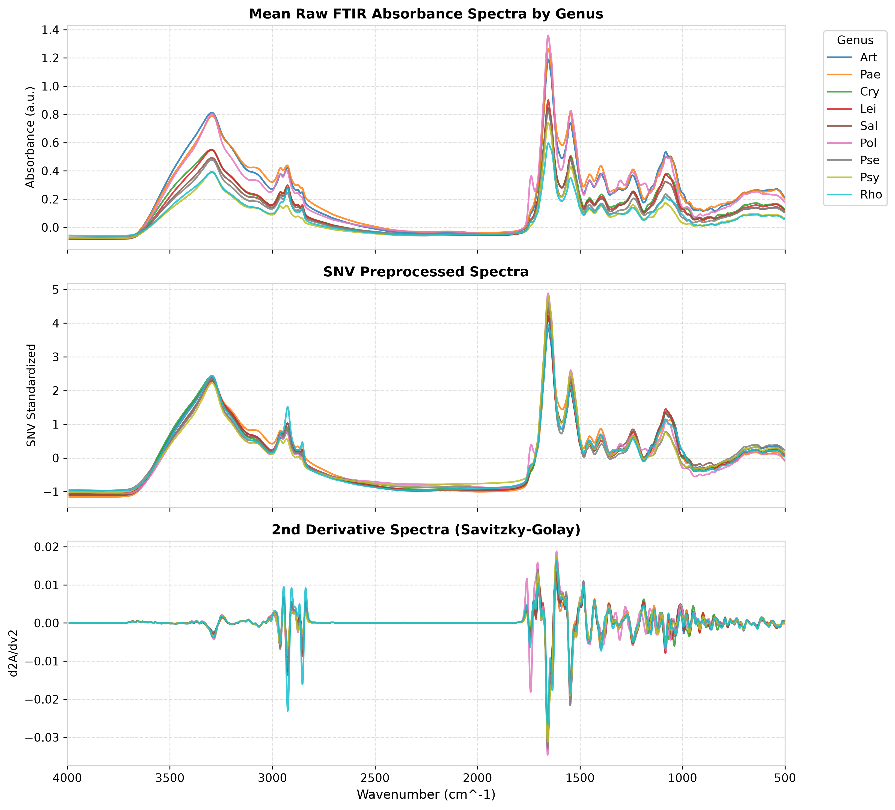

# Interactive FTIR Bacterial Spectroscopy & Chemometrics Web Suite

An interactive web application and chemometric analysis dashboard built for exploring, visualizing, and analyzing whole-cell Fourier Transform Infrared (FTIR) spectra of **45 bacterial isolates** (795 total spectra across 20 species and 9 genera).



---

## 🚀 Quick Start (Local Hosting)

The web dashboard is lightweight, static, and requires **no external backend server or database**. All spectral data, PCA coordinates, loading weights, and sample metadata are pre-packaged into optimized JSON and CSV data feeds.

### Option 1: Python Built-in HTTP Server (Recommended)
Run the following command from the project root directory:

```bash
# Using Python 3 built-in server
python -m http.server 8000

# Or using uv (if installed)
uv run python -m http.server 8000
```
Open your browser and navigate to: **`http://localhost:8000`**

### Option 2: Node.js `serve` / `npx`
```bash
npx serve ./ -p 8000
```
Open your browser and navigate to: **`http://localhost:8000`**

### Option 3: VS Code Live Server Extension
1. Open the project folder in **VS Code**.
2. Right-click [`index.html`](file:///C:/Users/hp/cli-images/ftir_bact/index.html) and select **"Open with Live Server"**.

---

## 🌐 Production Deployment & Static Hosting

Since this web suite consists of standard HTML5, CSS3, JavaScript, and static JSON/CSV data files, it can be deployed to any static web host in seconds.

### 1. GitHub Pages
1. Push this repository to GitHub.
2. Go to **Settings > Pages** in your GitHub repository.
3. Select the `main` or `master` branch and root `/` directory as the source.
4. Click **Save**. Your dashboard will be live at `https://<your-username>.github.io/<repo-name>/`.

### 2. Vercel
```bash
# Deploy via Vercel CLI
npx vercel
```
Or import the repository directly on [Vercel Dashboard](https://vercel.com).

### 3. Netlify
```bash
# Deploy via Netlify CLI
npx netlify deploy --prod --dir=.
```
Or drag and drop the project folder onto [Netlify Drop](https://app.netlify.com/drop).

### 4. Cloudflare Pages
1. Connect your Git repository to Cloudflare Pages.
2. Build command: *(leave empty)*
3. Build output directory: `.`
4. Deploy!

### 5. Nginx / Apache Web Server
Copy all contents of this directory to your web server root (e.g., `/var/www/html/ftir/`):
```bash
cp -r * /var/www/html/ftir/
```

---

## 📂 Directory & Data Architecture

```
ftir_bact/
├── index.html                   # Main single-page web dashboard
├── styles.css                   # Glassmorphism dark-themed design system
├── app.js                       # Interactive Chart.js spectral viewer & PCA engine
├── README.md                    # Hosting & deployment documentation
├── FTIR_data.xlsx               # Original Excel dataset (795 spectra x 1820 cols)
│
└── output_ftir/                 # Chemometrics data & figure output directory
    ├── ftir_web_data.json       # Fast JSON data feed for web spectral viewer & PCA
    ├── ftir_raw_data.csv        # Exported raw dataset (795 x 1820)
    ├── ftir_snv_preprocessed.csv# Standard Normal Variate (SNV) standardized spectra
    ├── ftir_pca_scores.csv      # Principal Component scores (PC1 - PC5)
    ├── raw_vs_snv_spectra.png   # High-res publication plot (Raw, SNV, 2nd Deriv)
    ├── pca_scores_loadings.png  # High-res PCA score scatter plot & loading weights
    ├── hca_dendrogram.png       # Ward's HCA dendrogram of 45 isolates
    ├── confusion_matrix.png     # Machine learning classification confusion matrix
    └── spectral_biomarker_regions.png # Functional group regions & biomarker peaks
```

---

## ✨ Features & Interactive Capabilities

1. **Overview & Stats Tab:** Visual metrics summary of 795 spectra, 45 isolates, 20 species, and interactive bar charts of species distribution across 9 genera.
2. **Spectral Viewer Tab:** Interactive line plots (Absorbance vs Wavenumber 4000 – 500 cm⁻¹) with toggleable preprocessing modes:
   - **Raw Absorbance**
   - **SNV (Standard Normal Variate)**
   - **2nd Derivative (Savitzky-Golay)**
   - Genus overlays and functional group region highlights (**W1 Lipids**, **W2 Amide I/II**, **W3 Nucleic Acids**, **W4 Carbohydrates**).
3. **PCA Chemometrics Tab:** Interactive 2D scatter plot of PC1 vs PC2 colored by bacterial genus with hover tooltips and loading weights.
4. **Taxonomy & HCA Tab:** High-resolution dendrogram displaying Ward's hierarchical cluster analysis of mean SNV spectra for all 45 isolates.
5. **Machine Learning & Biomarkers Tab:** 5-fold cross-validated confusion matrix and top discriminatory FTIR wavenumber peak identification.
6. **Data Export Tab:** Instant one-click downloads for clean CSV and JSON files formatted for Python (`pandas`, `scikit-learn`), R, or MATLAB.

---

## 🛠️ Re-running the Data Pipeline

If you modify `FTIR_data.xlsx` or want to re-run the chemometric algorithms, execute the Python processing script:

```bash
uv run --python 3.12 --with pandas --with numpy --with scipy --with scikit-learn --with matplotlib --with seaborn --with openpyxl python scratch/process_chemometrics.py
```

This will automatically re-calculate SNV preprocessing, PCA scores, Ward's HCA dendrogram, SVM/Random Forest models, and update `output_ftir/ftir_web_data.json` and all figures.

---

## 📖 Citation

If you use this dataset, web suite, or chemometric methodology in your research, please cite:

> **Antigravity AI Research Team (2026).** *Whole-Cell FTIR Spectroscopic Chemometrics and Machine Learning for High-Throughput Taxonomic Discrimination of 45 Environmental Bacterial Isolates.* Research Manuscript & Interactive Web Suite.
